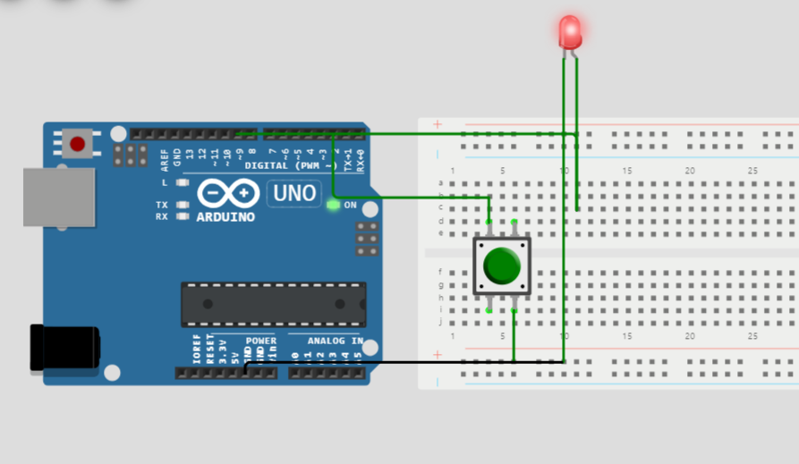
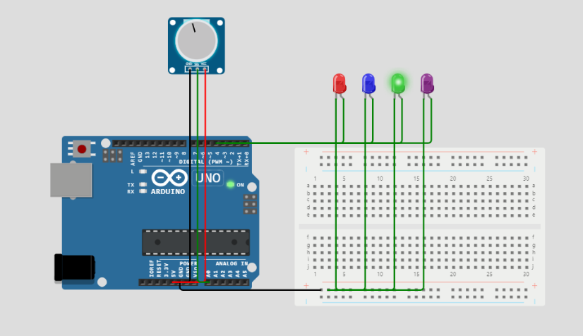

This repository contains various projects and tasks developed during my **Digital Logic Design (DLD)** and **Computer Organization and Assembly Language (COAL)** courses at **UET Lahore**. The projects involve different aspects of microcontroller programming, including circuit design, programming for LED lights, and WiFi-enabled lamp control. I have explored and implemented various concepts such as assembly language programming, LED control, random color generation, and communication protocols like WiFi using Arduino.

---

## Projects Overview

### 1. **LedLightDimAndIncrease**
   - A project where the LED light's intensity can be controlled to dim or increase.
   - This helps understand pulse-width modulation (PWM) and how to control analog output with a microcontroller.

### 2. **LightOn**
   - A simple implementation where an LED light turns on, demonstrating basic control logic using assembly language.

### 3. **SwitchCase**
   - A project where multiple states of a lamp are controlled using the `switch-case` construct in code. This demonstrates conditional branching in microcontroller programming.

### 4. **LampControler.asm**
   - Assembly language code for controlling the operation of a lamp. The project involves low-level programming, using assembly language to control hardware.

### 5. **RandomizeColorGenerate.ino**
   - This Arduino project involves generating random colors for an RGB LED. It demonstrates the use of random number generation to control LED color outputs.

### 6. **WifiServer.ino**
   - A WiFi-enabled project where the lamp can be controlled through a server using an ESP8266/ESP32 module, demonstrating basic networking concepts and communication over WiFi.

### 7. **blink.s**
   - A basic assembly program that blinks an LED, helping understand the time delays and control loops in assembly programming.

### 8. **rgbLightBlinking.ino**
   - A project where an RGB LED blinks in different colors, showing how to control multiple color channels and time delays.

---

## Skills and Knowledge Gained

- **Assembly Language**: I gained hands-on experience programming in assembly language for controlling hardware like LEDs and lamps.
- **Digital Logic Design**: Through projects like `SwitchCase` and `LampControler.asm`, I improved my understanding of digital circuits and how to implement them in code.
- **Microcontroller Programming**: I learned how to use microcontrollers (like Arduino) for controlling hardware, including generating random colors, controlling lamp brightness, and handling WiFi communication.
- **WiFi Communication**: The `WifiServer.ino` project helped me understand how to send and receive data over a network, allowing me to control hardware remotely.
- **PWM (Pulse Width Modulation)**: I worked with PWM signals to dim and control the intensity of the light in the `LedLightDimAndIncrease` project.

---

## Project Files

Here are the files included in this repository:

- **LampControler.asm**: Assembly code to control lamp functionality.
- **RandomizeColorGenerate.ino**: Arduino code to generate random colors for an RGB LED.
- **WifiServer.ino**: Arduino code for WiFi-enabled lamp control.
- **blink.s**: Assembly code for blinking an LED.
- **rgbLightBlinking.ino**: Arduino code to blink an RGB light.
- **SwitchCase**: Project utilizing `switch-case` to control lamp states.
- **LedLightDimAndIncrease**: Project to control LED dimming and intensity increase.

---

## Project Images

Here are images related to the projects:

1. **1st Task.PNG**:
   - A screenshot from the `LightOn` project showing the initial setup and execution.
   

2. **LightOn.PNG**:
   - A screenshot from the `LightOn` project showing the LED light turning on.
   

3. **switchCase.PNG**:
   - A screenshot demonstrating the `switch-case` logic used to control the lamp.
   

---

